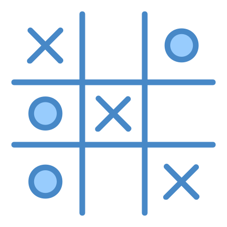

# Tic-Tac-Toe-AI

    

The objective of this projet is to show that an algorithm can always have the optimal behavior in a tic-tac-toe game.

To achieve it, I implemented an algorithm [MinMax](https://www.geeksforgeeks.org/minimax-algorithm-in-game-theory-set-1-introduction/) that determines the best next move and so, the opponent only has two options: draw or lose.
